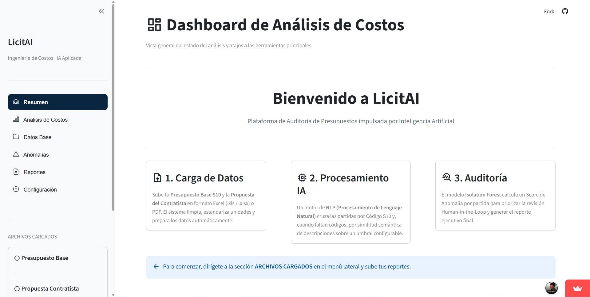
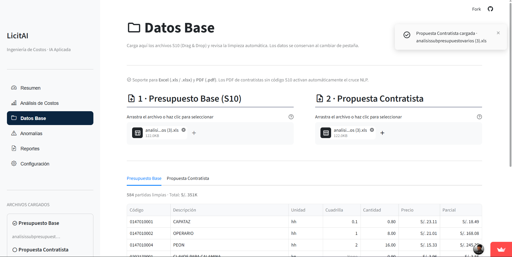
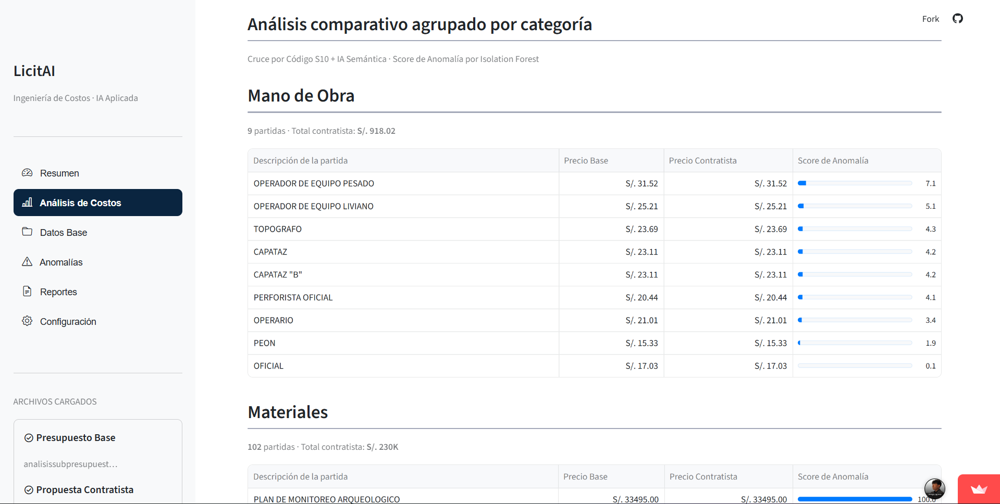
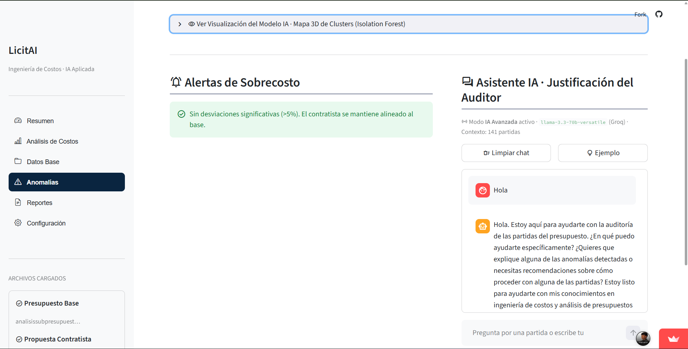
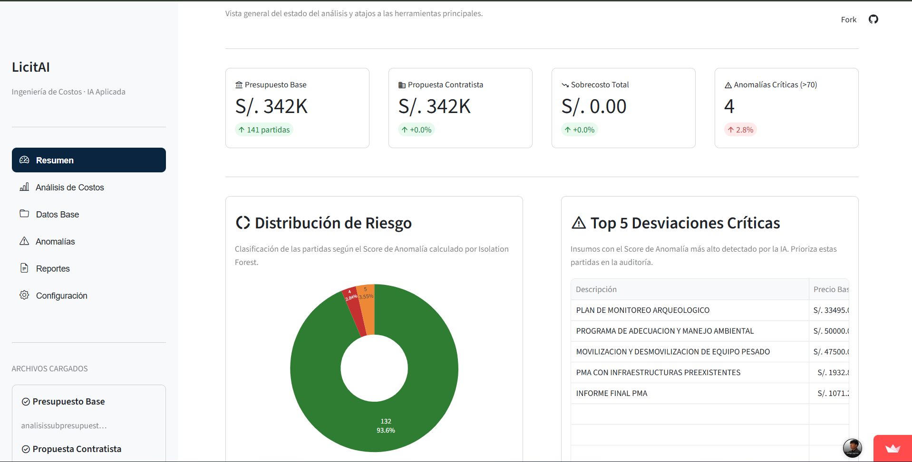

# LICITAI - AI Budget Auditing Platform

AI-powered budget auditing platform focused on anomaly detection, semantic analysis and intelligent cost evaluation for construction budgets.

---

## Overview

LICITAI is a web platform designed to assist auditors in detecting abnormal costs and inconsistencies in construction budget proposals using Artificial Intelligence techniques.

The platform combines:

- Natural Language Processing (NLP)
- Semantic similarity analysis
- Machine Learning anomaly detection
- Human-in-the-loop validation
- Interactive dashboards and reporting

---

## Features

- Upload and process S10 budget files
- Semantic matching between budget items
- Intelligent cost comparison
- Anomaly detection using Isolation Forest
- Interactive visual dashboards
- Human validation workflow
- Excel report export

---

## AI Workflow

1. File upload and preprocessing
2. Data cleaning and normalization
3. NLP semantic matching
4. Cost analysis
5. Anomaly detection
6. Human validation
7. Excel report generation

---

## Technologies

- Python
- Streamlit
- Machine Learning
- NLP
- Isolation Forest
- Pandas
- OpenPyXL

---

## Project Structure

```bash
licitai-budget-auditing/
│
├── screenshots/
├── docs/
├── app.py
├── requirements.txt
└── runtime.txt
```

---

## Screenshots

### Welcome Screen




### File Upload Module



---

### Cost Analysis Dashboard



---

### Anomaly Detection



---

### Reports Module



## Author

Rodrigo Mogrovejo
